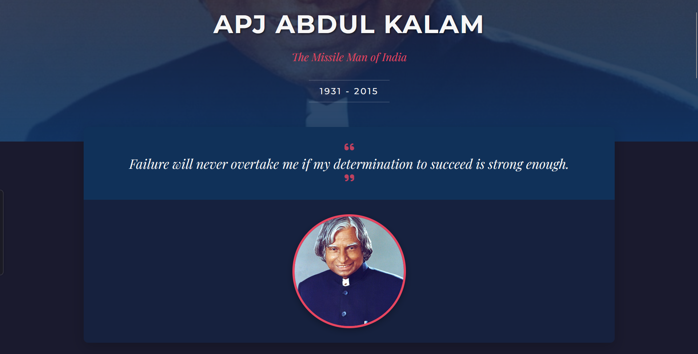

# APJ Abdul Kalam Tribute Page

## [View Live Demo](https://sainath-666.github.io/Tribute_Page_1/)

## About

A modern tribute page honoring Dr. APJ Abdul Kalam, the "Missile Man of India" and former President of India. This responsive page showcases his life, achievements, and inspiring quotes.

## Features

- Responsive design for all devices
- Interactive timeline of key life events
- Achievement cards with icons
- Collection of inspiring quotes
- Modern UI with animations

## Technologies

- HTML5
- CSS3 (Grid, Flexbox, Variables)
- Google Fonts
- Font Awesome Icons

## How to Use

1. Clone this repository
2. Open `index.html` in your browser
3. Explore the tribute page

  
Made with ❤️ by Sainathreddy

